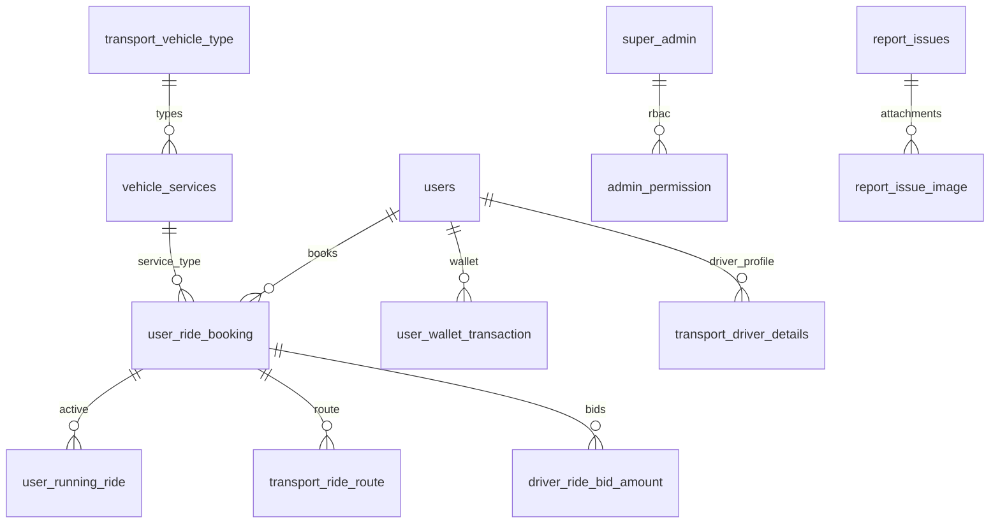

# 06 — Base de datos

## Motor

- **Producción:** MySQL 8, base `db_zemo_app`, host `127.0.0.1`
- **CI / tests:** SQLite `:memory:`

## Migraciones

**83 archivos** en `database/migrations/`.

Aplicar:

```bash
php artisan migrate
php artisan migrate:status
```

## Modelo conceptual (entidades principales)



## Tablas críticas

| Tabla | Rol |
|-------|-----|
| `users` | Pasajeros y conductores (flags `is_driver_*`, `access_token`, wallet) |
| `user_ride_booking` | Reservas / viajes |
| `user_running_ride` | Estado en curso |
| `transport_driver_details` | Vehículo, ubicación, estado conductor |
| `driver_ride_bid_amount` | Ofertas de precio |
| `user_wallet_transaction` | Movimientos billetera |
| `card_details` | Tokens tarjetas Wompi |
| `general_settings` | Config global (comisiones, API keys, flags) |
| `service_settings` | Config por servicio/área |
| `super_admin` | Cuentas panel |
| `admin_module` | Menú RBAC |
| `provider_documents` | KYC conductor |
| `cash_out` | Retiros |
| `report_issues` | Soporte |
| `sos` | Emergencias |
| `restricted_area` | Geo restricciones |
| `push_notification` | Campañas |

## Usuario unificado (customer + driver)

Un solo registro en `users` puede operar como pasajero y conductor según:

- `is_driver_type`, `is_driver_status`
- `driver_vehicle_status`, `driver_doc_status`
- `active_mode`

## Soft deletes

Varias consultas filtran `deleted_at IS NULL` en `users`.

## Colas y jobs

Tablas Laravel estándar: `jobs`, `failed_jobs` (si `QUEUE_CONNECTION=database`).

**Nota:** En EC2 no hay workers activos; jobs pueden acumularse si se encolan sin consumer.

## Constantes de negocio

Archivos en `config/`:

- `statusconstants.php` — estados de viaje
- `rejectcancelstring.php` — motivos cancelación
- `wallettransaction.php` — tipos transacción wallet
- `dateconstants.php`

## Backup recomendado (operaciones)

```bash
mysqldump -u USER -p db_zemo_app > backup_$(date +%F).sql
```

Programar en cron EC2 o AWS RDS snapshot cuando se migre.

## Seeds

Directorio `database/seeders/` — revisar antes de ejecutar en producción (`db:seed` puede sobrescribir datos).
