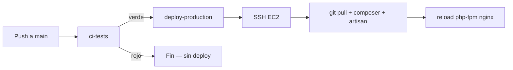

# 07 — CI/CD y calidad

## Repositorio canónico

- **GitHub:** `git@github.com:DESZIMO/Appzimo-Admin.git`
- **Rama principal:** `main`
- **Remote local:** `origin`

## Pipeline CI + CD

Archivo: `.github/workflows/backend.yml`

**Disparadores:** push y pull_request a `main`.

### Job `ci-tests` (CI)

| Paso | Herramienta | Propósito |
|------|-------------|-----------|
| Checkout | actions/checkout@v4 | Código |
| PHP 8.2 | shivammathur/setup-php | Extensions: mbstring, sqlite, gd, … |
| .env testing | shell | SQLite in-memory |
| Composer install | composer v2 | Dependencias + cache `vendor/` |
| Migrar BD | `php artisan migrate --force` | SQLite en CI |
| Validar rutas | `php artisan route:list` | Detecta controladores faltantes |
| PHPUnit | `vendor/bin/phpunit` | Tests automatizados |

Solo en **pull requests** y en **push a `main`** (sin deploy).

### Job `deploy-production` (CD)

Se ejecuta **solo** cuando:

1. El evento es `push` a `main` (no en PRs).
2. El job `ci-tests` terminó en verde.

Herramientas:

1. [appleboy/scp-action](https://github.com/appleboy/scp-action) — sube el código del runner a `/tmp/appzimo-cd-staging` en EC2 (no usa `git` en el servidor).
2. [appleboy/ssh-action](https://github.com/appleboy/ssh-action) — `rsync` al directorio de la app, `composer install`, migraciones y caches.

**No requiere** deploy key de GitHub en EC2 para el CD (evita `git pull` / `Permission denied (publickey)`).

Environment de GitHub: **`production`** (opcional: añadir required reviewers en Settings → Environments).

## Configurar CD en GitHub (obligatorio antes del primer deploy)

En el repo **DESZIMO/Appzimo-Admin** → **Settings → Secrets and variables → Actions**:

### Secrets (Repository secrets)

| Secret | Valor ejemplo | Uso |
|--------|----------------|-----|
| `EC2_HOST` | `ec2-18-208-4-15.compute-1.amazonaws.com` | Host SSH |
| `EC2_SSH_PORT` | `927` | Puerto SSH |
| `EC2_SSH_USER` | `ubuntu` | Usuario SSH (sudo) |
| `EC2_SSH_PRIVATE_KEY` | Contenido de `~/.ssh/app-zimo-root-key.pem` | Clave privada PEM |
| `EC2_DEPLOY_USER` | `appzimodevop` | Usuario dueño del código |
| `EC2_DEPLOY_PATH` | `/var/www/app-zimo-fox-drive-v2-clone` | Directorio de la app |
| `EC2_DB_MIGRATE_USERNAME` | *(opcional)* | Usuario MySQL con `ALTER` si no existe `/etc/mysql/debian.cnf` |
| `EC2_DB_MIGRATE_PASSWORD` | *(opcional)* | Contraseña del usuario de migración |

**Migraciones en EC2:** el `.env` de producción usa `zimo_restricted_user` (sin `ALTER`). El CD ejecuta `scripts/ec2-artisan-migrate.sh`, que usa credenciales de `/etc/mysql/debian.cnf` o de los secrets anteriores solo para `php artisan migrate --force`.

### Variables (opcional)

| Variable | Default | Uso |
|----------|---------|-----|
| `EC2_DEPLOY_BRANCH` | `main` | Rama a desplegar en el servidor |

### Prerrequisito en EC2 (una vez)

El servidor debe poder hacer `git pull` desde `DESZIMO/Appzimo-Admin` (deploy key o SSH key de `appzimodevop`). Ver `docs/09-alineacion-ec2-github.md` — Fase 2.

Sin esto, el job CD fallará en `git fetch` / `git pull`.

## Flujo completo



## Ejecutar CI localmente

```bash
cp .env.example .env
# Añadir APP_KEY, DB sqlite memory (ver workflow)
composer install
php artisan key:generate
php artisan migrate --force
php artisan route:list --except-vendor
./vendor/bin/phpunit
```

Requiere PHP 8.2 y extensión `gd` (como en GitHub Actions).

## Tests actuales

- `tests/Feature/ExampleTest.php` — health check
- `tests/Unit/ExampleTest.php` — placeholder

## Pint (opcional, no bloquea CI)

El código legacy no cumple las reglas de Laravel Pint (~168 archivos). **Pint no se ejecuta en CI.**

## Pull requests

1. Branch `feature/...` desde `main`
2. PR → solo corre **CI** (no CD)
3. Merge a `main` → **CI + CD** automático (si secrets configurados)

## Archivos históricos de pipeline

Documentos Word en `docs/archive/`. Referencia actual: este archivo + `backend.yml`.
